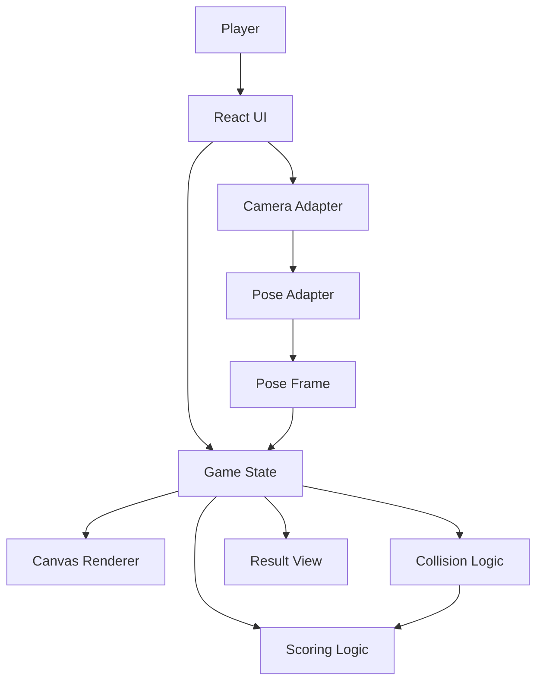
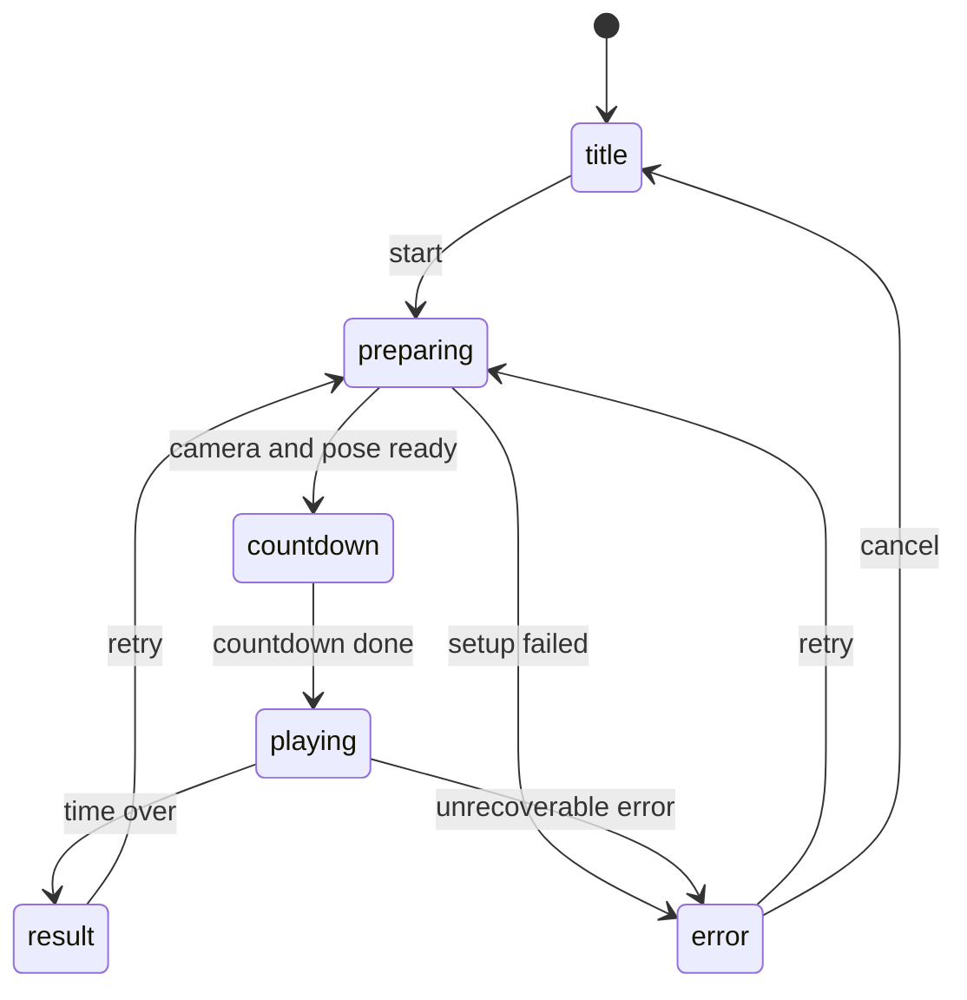
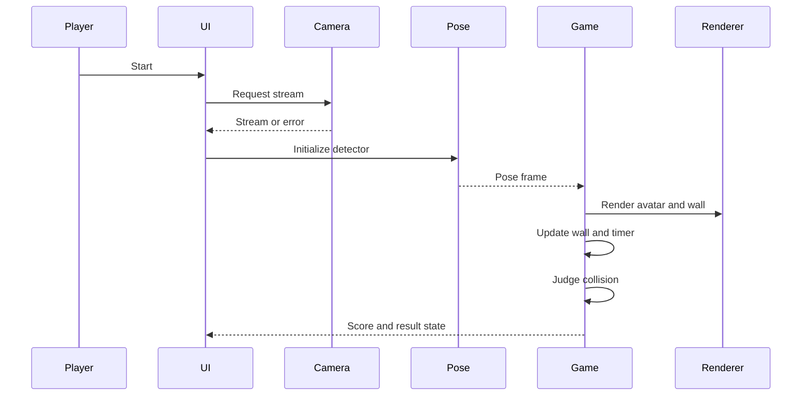

# Design Document

## Overview

`wall-dodge-game` は、カメラ入力でプレイヤーの姿勢を検出し、アバターを動かして迫る壁の穴に合わせる体験型ブラウザゲームである。対象ユーザーは高校生、オープンキャンパス来場者、研究室展示の来訪者、AIや画像認識の初学者である。

今回は最小構成を優先し、タイトル、カメラ開始、姿勢検出、簡単なアバター、少数の壁パターン、簡易当たり判定、スコア、結果画面までを単一ページで成立させる。ランキング、ユーザー登録、DB保存、バックエンド、音楽連動、詳細診断、高度なレベル管理は設計対象外とする。

### Goals

- Camera Input → Pose Detection → Avatar Display → Wall Pattern → Collision Judgment → Score / Result の一連の体験を最小構成で実現する。
- カメラ、姿勢検出、描画、ゲーム状態、当たり判定、スコアを責務分離し、後続の壁追加や判定調整をしやすくする。
- エラー時に、プレイヤーまたは展示運営者が次に取る行動を理解できる状態表示を行う。

### Non-Goals

- 参考リポジトリのコード、ファイル構成、UI、判定値、スコア式の移植。
- 複雑な壁パターン、高度なレベル管理、詳細な運動タイプ診断。
- ランキング、ユーザー登録、データベース保存、バックエンド、WebSocket、音楽連動。
- 複数ページ構成や大規模なゲームエンジン導入。

## Boundary Commitments

### This Spec Owns

- ブラウザ上で完結する最小の壁回避ゲーム体験。
- タイトル、準備、カウントダウン、プレイ中、結果、エラーのゲーム状態。
- カメラ入力と姿勢検出の起動、停止、失敗時のユーザー表示。
- 姿勢検出結果をゲーム用の姿勢データへ変換する契約。
- アバター表示、壁表示、簡易当たり判定、スコア計算、結果表示。

### Out of Boundary

- 参考リポジトリのコードコピーまたは構成移植。
- サーバー保存、認証、ランキング、ユーザー管理。
- 複雑な運動診断、レベル別の多段階難易度、音楽連動。
- 複数人同時プレイやネットワーク同期。
- 本番配信インフラ、HTTPS証明書管理、展示端末のOS設定。

### Allowed Dependencies

- ブラウザのカメラAPI。
- 姿勢検出ライブラリとしてMediaPipe Tasks Vision系のWeb対応パッケージ。
- React、TypeScript、Viteを中心としたフロントエンド開発環境。
- Canvas 2DまたはReact/HTML/CSSによる表示。初期設計ではゲーム面の描画はCanvas 2Dを第一候補にする。

### Revalidation Triggers

- 姿勢検出ライブラリまたは出力ランドマーク形式を変更する場合。
- 壁パターンの形状表現を矩形中心から複雑な人型形状へ変更する場合。
- スコア式、失敗時の扱い、制限時間を要件レベルで変更する場合。
- バックエンド保存、ランキング、ユーザー識別を追加する場合。
- カメラを使わないモックモードを正式なユーザー向け機能として扱う場合。

## Architecture

### Existing Architecture Analysis

現時点では `package.json` と `src/` は存在しない。既存コードの拡張ではなく、初期フロントエンド構成の作成から始める。既存の `README.md` はプロジェクト名のみであり、実装後に起動方法とカメラ利用条件を追記する。

### Architecture Pattern & Boundary Map

Selected pattern: 責務分離したクライアント単一ページ構成。



Key decisions:

- UIはゲーム状態とユーザー操作を扱う。
- カメラと姿勢検出はアダプターで隔離し、外部ライブラリ固有の型をゲームロジックへ広げない。
- 当たり判定とスコアは純粋関数として設計し、テスト可能にする。
- Canvas描画は表示責務に限定し、判定やスコアの決定権を持たない。

### Technology Stack

| Layer | Choice / Version | Role in Feature | Notes |
|-------|------------------|-----------------|-------|
| Frontend | React + TypeScript | 画面状態、UI、ユーザー操作 | 初期構成として採用候補 |
| Build | Vite | 開発サーバー、ビルド | 現行ViteはNode.js 20.19+または22.12+が必要 |
| Camera | Browser MediaDevices | カメラ映像ストリーム取得 | 安全なコンテキストとユーザー許可が必要 |
| Pose Detection | MediaPipe Tasks Vision Pose Landmarker | 姿勢ランドマーク取得 | アダプター内に閉じ込める |
| Rendering | Canvas 2D | アバター、壁、簡易エフェクト描画 | React再レンダリングと分離 |
| Storage | なし | 保存しない | ランキングやDBは範囲外 |
| Backend | なし | 通信しない | ブラウザ内で完結 |

## 画面構成

### 画面一覧

| Screen | Purpose | Main UI | Requirements |
|--------|---------|---------|--------------|
| Title | 初回表示と開始導線 | タイトル、短い説明、開始ボタン | 1.1, 1.2, 1.3 |
| Preparing | カメラと姿勢検出の準備 | 準備中表示、権限待ち表示 | 1.4, 2.1 |
| Countdown | プレイ直前の準備 | カウントダウン、アバター確認 | 4.1, 4.2, 4.3 |
| Playing | ゲーム本体 | Canvasゲーム面、スコア、残り時間、状態表示 | 3.1, 5.1, 6.1, 7.1, 8.2 |
| Result | 結果確認と再試行 | 最終スコア、再試行ボタン | 8.3, 8.4, 9.1, 9.2 |
| Error | 失敗時の導線 | エラー理由、再試行ボタン | 2.3, 2.4, 2.5, 9.3 |

### UI Layout Policy

- 最初の画面はランディングページではなく、すぐ開始できるタイトル画面にする。
- 展示用途を優先し、説明文は短く、開始ボタンと状態表示を明確にする。
- プレイ中はゲーム面、スコア、残り時間、検出状態を一画面に収める。
- カメラ映像そのものは主表示にしない。必要な場合もデバッグ用途として扱い、通常UIには出さない。

## ゲーム状態の流れ



### State Model

| State | Meaning | Exit Conditions |
|-------|---------|-----------------|
| `title` | 初期画面 | 開始操作 |
| `preparing` | カメラ取得、姿勢検出準備 | 準備完了またはエラー |
| `countdown` | プレイ直前 | カウントダウン終了 |
| `playing` | 壁回避中 | 制限時間終了または回復不能エラー |
| `result` | 最終スコア表示 | 再試行 |
| `error` | プレイ不能または継続不能 | 再試行またはタイトルへ戻る |

状態遷移は一箇所で管理し、カメラや姿勢検出の副作用は状態に応じて開始・停止する。

## データの流れ



### Data Pipeline

1. カメラアダプターが映像ストリームを取得する。
2. 姿勢検出アダプターが動画フレームからランドマークを取得する。
3. アダプターが外部ライブラリの出力を `PoseFrame` に正規化する。
4. ゲーム状態が `PoseFrame`、現在の壁、残り時間からフレーム状態を更新する。
5. 描画層がゲーム状態を受け取り、アバター、壁、HUD補助表示を描く。
6. 判定タイミングで当たり判定を実行し、スコアを更新する。
7. 制限時間終了後、結果表示へ遷移する。

## カメラ入力の扱い

### Design

- カメラはプレイヤーの開始操作後にだけ要求する。
- 要求するメディアは映像のみとする。
- カメラ準備中は `preparing` 状態で表示する。
- 取得したMediaStreamはアダプターが所有し、終了時にtrackを停止する。
- ユーザーが許可ダイアログに反応しない場合でも、UIは準備中として分かる表示を続ける。

### Error Mapping

| Case | User-visible State |
|------|--------------------|
| 権限拒否 | カメラ許可が必要であることと再試行導線を表示 |
| カメラなし | カメラが見つからないことを表示 |
| 読み取り不能 | 他アプリの使用中やブラウザ制約の可能性を表示 |
| 安全でないコンテキスト | `localhost` またはHTTPSで開く必要があることを表示 |

## 骨格検出の扱い

### Design

- 姿勢検出はカメラ取得後に初期化する。
- 外部ライブラリの出力は `PoseFrame` に変換する。
- ゲームロジックは `PoseFrame` だけを参照し、MediaPipe固有型を参照しない。
- 初期実装では1人分の姿勢だけを扱う。
- 検出不能が一時的であればプレイを継続し、判定タイミングで検出不能なら判定不能または失敗として扱う。

### Pose Contract

```typescript
type PoseLandmarkName =
  | "nose"
  | "leftShoulder"
  | "rightShoulder"
  | "leftElbow"
  | "rightElbow"
  | "leftWrist"
  | "rightWrist"
  | "leftHip"
  | "rightHip"
  | "leftKnee"
  | "rightKnee"
  | "leftAnkle"
  | "rightAnkle";

type NormalizedPoint = {
  x: number;
  y: number;
  visibility: number;
};

type PoseFrame = {
  detected: boolean;
  timestampMs: number;
  landmarks: Partial<Record<PoseLandmarkName, NormalizedPoint>>;
};
```

## アバター表示の設計

### Design

- アバターは `PoseFrame` のランドマークを使い、頭、胴体、腕、脚を面と太さのある
  シルエットとして描画する。ランドマーク点や骨格線は通常表示しない。
- アバターは迫ってくる壁を見ている後ろ姿とし、顔を描かず、後頭部、背面の衣服、
  背中のラインによって向きを伝える。
- モック姿勢も実カメラ姿勢と同じ配色と後ろ姿の身体表現を使用する。
- カメラ映像そのものを主表示にしない。
- 検出中はランドマーク位置に合わせて更新する。
- 検出不能時は、アバターを薄くする、または「姿勢を検出できません」と表示する。
- 画像素材や3Dモデルは追加せず、Canvas 2Dの図形で描画する。
- 判定領域はアバターより背面へ薄く描画し、キャラクターの視認性を妨げない。

### Rendering Contract

```typescript
type RenderFrameInput = {
  phase: GamePhase;
  pose: PoseFrame;
  wall: ActiveWall | null;
  score: ScoreState;
  feedback: JudgmentFeedback | null;
  remainingMs: number;
};
```

## 壁パターンの設計

### Design

- 初期実装では1から3種類の壁パターンをデータで定義する。
- 各壁は、表示用の安全領域と判定用の安全領域を持つ。
- 複雑な人型くり抜きではなく、矩形や単純な複合矩形から開始する。
- 壁はプレイヤーに迫る進行度を持ち、判定位置に到達した時点で一度だけ判定する。

### Wall Contract

```typescript
type Rect = {
  x: number;
  y: number;
  width: number;
  height: number;
};

type WallPattern = {
  id: string;
  label: string;
  safeZones: Rect[];
  requiredLandmarks: PoseLandmarkName[];
  scoreValue: number;
};

type ActiveWall = {
  pattern: WallPattern;
  progress: number;
  judged: boolean;
};
```

初期候補:

- 中央に立つ。
- 左に寄る。
- 右に寄る。

## 当たり判定の設計

### Design

- 判定は `PoseFrame` と `WallPattern` を入力する純粋関数にする。
- `requiredLandmarks` のうち、十分なvisibilityを持つ点が安全領域内にあるかを判定する。
- 最小構成では、全必須点がいずれかの安全領域に入れば成功とする。
- 判定時に姿勢が未検出、または必須点が不足する場合は `notDetected` または `miss` として扱う。
- 判定の甘さは定数または壁パターン側のデータとして後で調整できるようにする。

### Collision Contract

```typescript
type JudgmentResult =
  | { type: "success"; patternId: string; scoreDelta: number }
  | { type: "miss"; patternId: string; reason: "outsideSafeZone" | "missingLandmark" }
  | { type: "notDetected"; patternId: string };

type CollisionInput = {
  pose: PoseFrame;
  wall: ActiveWall;
};
```

## スコア計算の設計

### Design

- 初期実装では成功時に壁パターンの `scoreValue` を加算する。
- 失敗時はスコアを減算しない。
- コンボ、レベル倍率、診断、ランキングは今回範囲外。
- 結果画面には最終スコアを表示する。

### Score Contract

```typescript
type ScoreState = {
  value: number;
  successCount: number;
  missCount: number;
};
```

スコア更新は `JudgmentResult` を入力し、新しい `ScoreState` を返す純粋関数にする。

## エラー処理

### Error Types

```typescript
type GameError =
  | { type: "cameraPermissionDenied" }
  | { type: "cameraNotFound" }
  | { type: "cameraNotReadable" }
  | { type: "insecureContext" }
  | { type: "poseInitializationFailed"; message: string }
  | { type: "unexpected"; message: string };
```

### Error Policy

- エラーはUI表示用のメッセージと再試行導線へ変換する。
- `cameraPermissionDenied`、`cameraNotFound`、`insecureContext` はゲーム開始前エラーとして扱う。
- `poseInitializationFailed` は再試行可能なエラーとして扱う。
- プレイ中の一時的な姿勢未検出は即時エラー画面へ遷移せず、判定結果または状態表示として扱う。
- 回復不能な例外は `error` 状態へ遷移する。

## File Structure Plan

### 使用する既存ファイル

- `README.md` — 実装後にセットアップ、起動方法、カメラ利用条件を追記する。
- `AGENTS.md` — Codex向け作業規約と参考リポジトリ利用境界を確認する。
- `.kiro/steering/product.md` — プロダクト目的と参考境界。
- `.kiro/steering/tech.md` — 技術方針とエラー処理方針。
- `.kiro/steering/structure.md` — 責務分離と配置方針。
- `.kiro/specs/wall-dodge-game/requirements.md` — 本設計の要求元。

### 新しく作成するファイル

```text
package.json
index.html
tsconfig.json
vite.config.ts
src/
├── main.tsx
├── App.tsx
├── style.css
├── camera/
│   └── camera.ts
├── pose/
│   ├── poseDetector.ts
│   └── poseTypes.ts
├── game/
│   ├── types.ts
│   ├── state.ts
│   ├── wallPatterns.ts
│   ├── collision.ts
│   └── scoring.ts
├── rendering/
│   └── canvasRenderer.ts
└── components/
    ├── TitleScreen.tsx
    ├── GameScreen.tsx
    ├── ResultScreen.tsx
    └── ErrorScreen.tsx
```

Responsibilities:

- `package.json` — 開発、ビルド、型チェック、テストのnpm scriptsと依存関係。
- `index.html` — ブラウザエントリ。
- `vite.config.ts` — Vite設定。
- `src/main.tsx` — Reactアプリ起動。
- `src/App.tsx` — 画面状態と主要イベントの統合。
- `src/style.css` — 最小UIスタイル。
- `src/camera/camera.ts` — カメラストリームの取得、エラー分類、停止。
- `src/pose/poseDetector.ts` — 姿勢検出ライブラリ初期化と `PoseFrame` 変換。
- `src/pose/poseTypes.ts` — 姿勢データ型。
- `src/game/types.ts` — ゲーム状態、壁、判定、スコアの共有型。
- `src/game/state.ts` — 状態遷移とタイマー更新。
- `src/game/wallPatterns.ts` — 初期壁パターンのデータ。
- `src/game/collision.ts` — 当たり判定の純粋関数。
- `src/game/scoring.ts` — スコア更新の純粋関数。
- `src/rendering/canvasRenderer.ts` — アバターと壁のCanvas描画。
- `src/components/*.tsx` — 画面単位の表示コンポーネント。

### 変更するファイル

- `README.md` — 実装後にセットアップ、開発サーバー起動、ブラウザカメラ利用条件を追記する。

既存の `AGENTS.md`、steering、requirementsは実装時に参照するが、通常の実装タスクでは変更しない。

## Components and Interfaces

| Component | Domain | Intent | Req Coverage | Key Dependencies | Contracts |
|-----------|--------|--------|--------------|------------------|-----------|
| App | UI State | 画面状態とユーザー操作を統合 | 1.1-9.3 | Camera Adapter P0, Pose Adapter P0, Game Logic P0 | State |
| Camera Adapter | Input | カメラ取得と停止 | 2.1-2.5 | Browser MediaDevices P0 | Service |
| Pose Adapter | Input | 姿勢検出と正規化 | 2.1, 2.2, 3.1-3.4 | MediaPipe Tasks Vision P0 | Service |
| Game State | Domain | 状態遷移、タイマー、壁進行 | 4.1-8.4, 9.1-9.2 | Collision P0, Scoring P0 | State |
| Wall Pattern Data | Domain | 最小壁パターン定義 | 5.1-5.5 | Game Types P0 | Data |
| Collision Logic | Domain | 成功、失敗、検出不能判定 | 6.1-6.5 | PoseFrame P0, WallPattern P0 | Service |
| Scoring Logic | Domain | スコア更新 | 7.1-7.5, 8.4 | JudgmentResult P0 | Service |
| Canvas Renderer | Rendering | アバターと壁を描画 | 3.1-5.4, 6.2-6.3 | RenderFrameInput P0 | Service |
| Screen Components | UI | 各状態の表示と導線 | 1.1-1.4, 8.3-9.3 | App State P0 | Props |

### Camera Adapter

**Responsibilities & Constraints**

- ユーザー操作後にカメラ映像だけを要求する。
- 取得したMediaStreamを所有し、停止時に全trackを停止する。
- DOMExceptionを `GameError` に分類する。

**Service Interface**

```typescript
type CameraResult =
  | { ok: true; stream: MediaStream }
  | { ok: false; error: GameError };

interface CameraService {
  requestCamera(): Promise<CameraResult>;
  stopCamera(stream: MediaStream): void;
}
```

### Pose Adapter

**Responsibilities & Constraints**

- 姿勢検出ライブラリの初期化とフレーム推論を担当する。
- 出力は必ず `PoseFrame` に変換する。
- 外部ライブラリ固有の型をUIやゲームロジックへ渡さない。

**Service Interface**

```typescript
type PoseDetectorResult =
  | { ok: true; detector: PoseDetectorService }
  | { ok: false; error: GameError };

interface PoseDetectorService {
  detect(video: HTMLVideoElement, timestampMs: number): PoseFrame;
  dispose(): void;
}
```

### Game State

**Responsibilities & Constraints**

- `GamePhase`、残り時間、アクティブ壁、スコア、フィードバックを保持する。
- 壁が判定位置に到達したら、1つの壁につき1回だけ判定する。
- `result` または `error` へ遷移したら、描画ループとカメラ停止へつなげる。

```typescript
type GamePhase = "title" | "preparing" | "countdown" | "playing" | "result" | "error";

type GameState = {
  phase: GamePhase;
  pose: PoseFrame;
  activeWall: ActiveWall | null;
  score: ScoreState;
  remainingMs: number;
  feedback: JudgmentFeedback | null;
  error: GameError | null;
};
```

### Collision Logic

**Responsibilities & Constraints**

- 入力データだけで結果が決まる純粋関数にする。
- 必須ランドマークが不足している場合は、成功にしない。
- 判定閾値や余白は壁パターンまたは定数として調整可能にする。

```typescript
interface CollisionService {
  judge(input: CollisionInput): JudgmentResult;
}
```

### Scoring Logic

**Responsibilities & Constraints**

- 成功時にスコアを加算する。
- 初期実装では失敗時の減点、コンボ、倍率を持たない。

```typescript
interface ScoringService {
  applyJudgment(score: ScoreState, judgment: JudgmentResult): ScoreState;
}
```

## Requirements Traceability

| Requirement | Summary | Components | Interfaces | Flows |
|-------------|---------|------------|------------|-------|
| 1.1 | ページ表示時にタイトル画面 | App, TitleScreen | GameState | 状態遷移 |
| 1.2 | 開始操作を表示 | TitleScreen | Props | 画面構成 |
| 1.3 | 開始操作で準備へ進む | App, Camera Adapter | CameraService | 状態遷移 |
| 1.4 | 準備中表示 | App, GameScreen | GameState | 状態遷移 |
| 2.1 | カメラ許可後に姿勢検出開始 | Camera Adapter, Pose Adapter | CameraService, PoseDetectorService | データの流れ |
| 2.2 | 姿勢をゲーム操作として扱う | Pose Adapter, Game State | PoseFrame | データの流れ |
| 2.3 | カメラ拒否時のエラー | Camera Adapter, ErrorScreen | GameError | エラー処理 |
| 2.4 | カメラ利用不可の表示 | Camera Adapter, ErrorScreen | GameError | エラー処理 |
| 2.5 | 姿勢検出開始失敗の表示 | Pose Adapter, ErrorScreen | GameError | エラー処理 |
| 3.1 | 姿勢に基づくアバター表示 | Pose Adapter, Canvas Renderer | PoseFrame, RenderFrameInput | データの流れ |
| 3.2 | 動きに合わせて更新 | Pose Adapter, Canvas Renderer | PoseFrame | データの流れ |
| 3.3 | 姿勢未検出状態を表示 | Pose Adapter, GameScreen | PoseFrame | エラー処理 |
| 3.4 | カメラ映像でなくアバター主表示 | Canvas Renderer, GameScreen | RenderFrameInput | 画面構成 |
| 3.5 | 壁を向いた後ろ姿アバター | Canvas Renderer | PoseFrame, RenderFrameInput | アバター表示の設計 |
| 4.1 | 準備完了後カウントダウン | Game State | GamePhase | 状態遷移 |
| 4.2 | カウントダウン中は判定しない | Game State, Collision Logic | GamePhase | 状態遷移 |
| 4.3 | カウントダウン後プレイへ | Game State | GamePhase | 状態遷移 |
| 4.4 | 現在状態の表示 | Screen Components | GameState | 画面構成 |
| 5.1 | プレイ開始で壁表示 | Game State, Canvas Renderer | ActiveWall | データの流れ |
| 5.2 | 壁が迫る表示 | Game State, Canvas Renderer | ActiveWall | データの流れ |
| 5.3 | 少数壁パターン | Wall Pattern Data | WallPattern | 壁パターン設計 |
| 5.4 | 安全領域表示 | Wall Pattern Data, Canvas Renderer | Rect | 壁パターン設計 |
| 5.5 | 複雑な壁と高度レベル除外 | Wall Pattern Data | Boundary | Boundary Commitments |
| 6.1 | 判定位置で比較 | Game State, Collision Logic | CollisionInput | データの流れ |
| 6.2 | 成功表示 | Game State, GameScreen | JudgmentFeedback | データの流れ |
| 6.3 | 失敗表示 | Game State, GameScreen | JudgmentFeedback | データの流れ |
| 6.4 | 検出不能時の扱い | Collision Logic, GameScreen | JudgmentResult | エラー処理 |
| 6.5 | 簡易判定 | Collision Logic | CollisionService | 当たり判定設計 |
| 7.1 | プレイ中スコア表示 | GameScreen | ScoreState | 画面構成 |
| 7.2 | 成功時加算 | Scoring Logic | ScoringService | スコア計算 |
| 7.3 | 失敗表示 | Game State, GameScreen | JudgmentFeedback | データの流れ |
| 7.4 | 現在スコア確認 | GameScreen | ScoreState | 画面構成 |
| 7.5 | ランキング等除外 | Scoring Logic | Boundary | Boundary Commitments |
| 8.1 | 制限時間あり | Game State | remainingMs | 状態遷移 |
| 8.2 | 残り時間表示 | GameScreen | GameState | 画面構成 |
| 8.3 | 時間終了で結果 | Game State, ResultScreen | GamePhase | 状態遷移 |
| 8.4 | 最終スコア表示 | ResultScreen | ScoreState | 結果画面 |
| 8.5 | 詳細診断除外 | ResultScreen | Boundary | Boundary Commitments |
| 9.1 | 再試行導線 | ResultScreen | Props | 状態遷移 |
| 9.2 | 新規プレイへ戻る | App, Game State | GamePhase | 状態遷移 |
| 9.3 | エラー時の次行動表示 | ErrorScreen | GameError | エラー処理 |
| 9.4 | バックエンド不要 | Architecture | Boundary | Boundary Commitments |
| 9.5 | 音楽連動等除外 | Architecture | Boundary | Boundary Commitments |

## Testing Strategy

### Unit Tests

- `collision.ts`: 安全領域内、外、必須ランドマーク不足、姿勢未検出の判定。
- `scoring.ts`: 成功時加算、失敗時据え置き、検出不能時据え置き。
- `state.ts`: `title` から `result` までの状態遷移、カウントダウン中に判定しないこと、時間終了時の結果遷移。

### Integration Tests

- カメラ許可成功時に `preparing` から `countdown` へ進む。
- カメラ拒否時に `error` 画面へ進み、再試行導線が表示される。
- 姿勢未検出時にプレイ画面が検出不能状態を表示する。

### Manual Validation

- Ubuntuサーバー上で開発サーバーを起動し、ブラウザから `localhost` でカメラ許可を確認する。
- 別端末から確認する場合は、安全なコンテキスト要件を満たすか確認する。
- 実際に体を左右または中央へ動かし、成功と失敗が区別されることを確認する。

## 実装上の注意点

- 参考リポジトリのコード、型、CSS、壁データ、判定式、スコア式をコピーしない。
- まず画面状態とモック姿勢または最小壁データでゲーム状態を固め、その後カメラと姿勢検出を接続する。
- カメラ開始はユーザー操作後に行い、アプリ起動直後に要求しない。
- MediaStreamと姿勢検出インスタンスは、再試行、結果表示、エラー遷移、アンマウント時に解放する。
- `requestAnimationFrame` のループは二重起動しないようにする。
- TypeScriptでは `any` を使わず、外部ライブラリ境界でも明示型または `unknown` からの変換で扱う。
- Canvas描画は判定の根拠を持たず、判定は `collision.ts` に集約する。
- 最小構成を優先し、壁パターン追加、コンボ、レベル、診断は後続タスクに回す。
