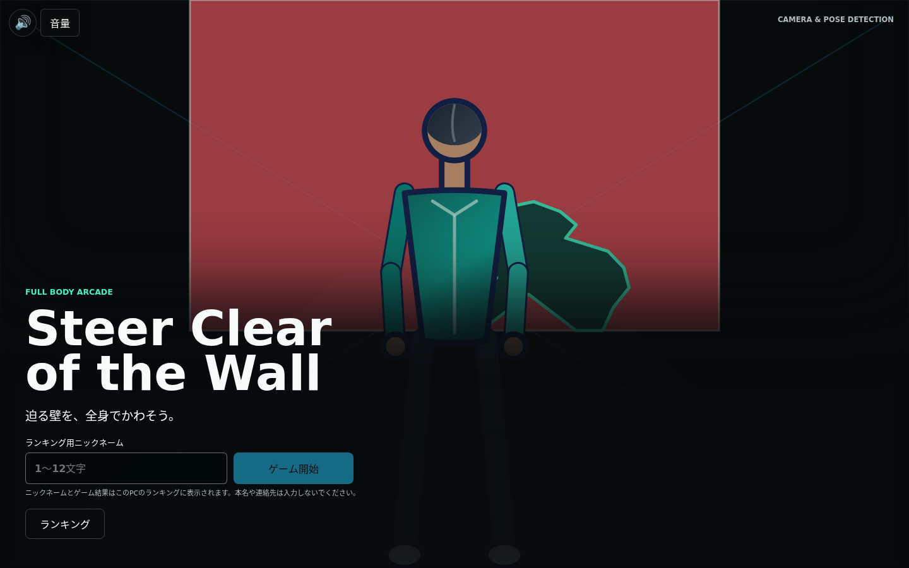
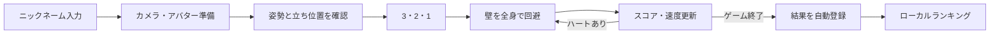
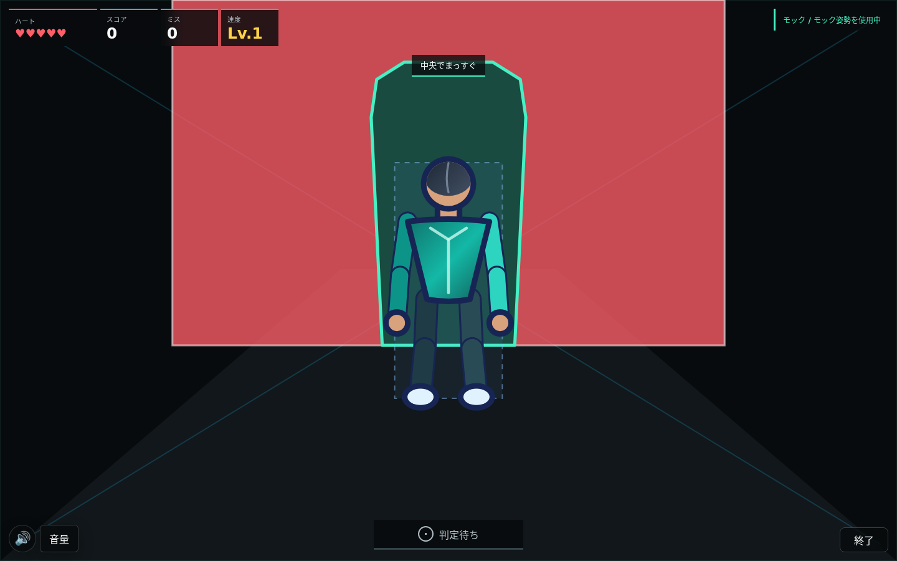
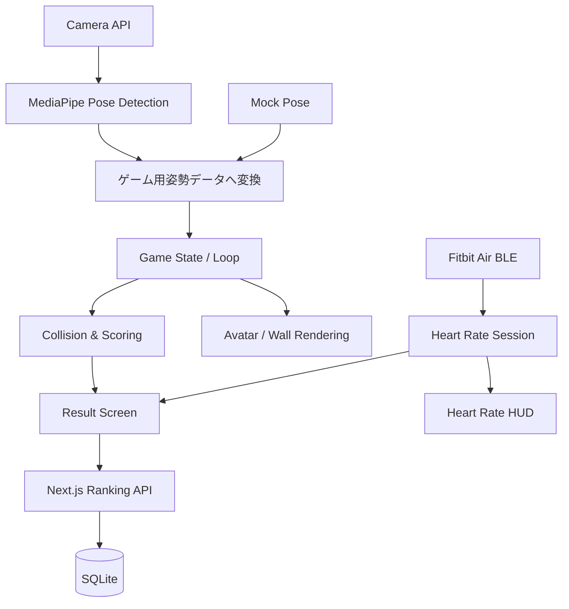

<div align="center">

# STEER CLEAR OF THE WALL

### 迫る壁を、全身でかわそう。

カメラ × 姿勢検出 × アバターで遊ぶ、体感型ブラウザゲーム


</div>



`steer-clear-of-the-wall`は、カメラの前で体を動かし、画面奥から迫る壁の穴へ
アバターを合わせて避けるブラウザゲームです。カメラ映像そのものではなく、
MediaPipeで検出した姿勢から描くアバターを主役にしています。

> キーボードもゲームパッドも不要。コントローラーは、プレイヤー自身の体です。

## Highlights

| | 特徴 | 内容 |
|---|---|---|
| 🧍 | Full-body control | 全身の姿勢を検出し、Canvas上のアバターへ反映 |
| 🧱 | Human-shaped walls | 頭・胴体・腕・脚を意識した人型の安全領域 |
| ⚡ | Progressive speed | 成功するほど壁が速くなる段階的な難易度 |
| 🎛️ | Arcade presentation | 近未来アーケード × 体感スポーツのUIと演出 |
| 🎵 | Procedural audio | Web Audio APIで合成するBGMと効果音 |
| ♥ | Live heart rate | Fitbit AirのBLE心拍数をHUDと結果グラフへ表示 |
| 🏆 | Local ranking | 同じPCのSQLiteへ結果を保存するTop 100ランキング |
| 🧪 | Mock pose mode | カメラなしでも最後まで動作確認できるモック姿勢 |

## Quick Start

必要なものはNode.js、npm、モダンブラウザです。

```bash
npm install
npm run dev
```

ブラウザで[http://localhost:3000](http://localhost:3000)を開きます。

カメラを使わずに確認する場合は、ゲーム開始後に「モック姿勢で試す」を選択してください。

## Game Flow



1. タイトル画面でランキング表示用のニックネームを入力します。
2. アバター外見と、実カメラまたはモック姿勢を選びます。
3. 実カメラでは、全身・中央位置・距離・姿勢の安定を確認します。
4. カウントダウン後、迫る壁の安全領域へアバターを合わせます。
5. 成功するとスコアが増え、連続成功に応じて壁が速くなります。
6. ハート5個がなくなると結果を表示し、同じPCのランキングへ自動登録します。

## Gameplay



- プレイ中はハート、スコア、ミス、速度レベルを常時表示します。
- Fitbit Air接続時は現在心拍数を表示し、結果画面で最小・平均・最大と時系列グラフを確認できます。
- 各壁は「確認 → 構える → いま！」の接近表示で判定タイミングを案内し、
  ジャンプでは上向き矢印と専用文言を表示します。
- 安全領域は矩形だけでなく、体の各部位をつないだシルエットとして描画します。
- 成功、失敗、速度上昇は色、形、短い文言、効果音で区別できます。
- 壁は初期状態で約2.4秒かけて判定位置へ到達し、成功枚数に応じて加速します。
- `prefers-reduced-motion`が有効な場合、装飾的な動きを停止または短縮します。

アバター外見は「男性風」「女性風」「ニュートラル」から本人が選択します。
カメラ画像から性別や性自認を推定することはありません。

## Architecture



カメラ、姿勢検出、描画、ゲーム進行、判定、スコア、ランキングを分離しています。
当たり判定とスコア計算はブラウザAPIやCanvasへ依存しない純粋ロジックとしてテストします。

### Tech Stack

| 領域 | 技術 |
|---|---|
| Application | Next.js 16 / React 19 / TypeScript 6 |
| Pose detection | MediaPipe Tasks Vision |
| Rendering | Canvas 2D API |
| Audio | Web Audio API |
| Ranking | Next.js Route Handlers / better-sqlite3 |
| Unit test | Vitest |
| Browser E2E | Playwright / Chromium |

## Camera Modes

### 実カメラ

「カメラを開始」を押してブラウザのカメラ利用を許可します。全身が映り、中央位置と
距離が適切な状態を短時間維持すると、自動的にカウントダウンへ進みます。

- カメラは映像だけを取得し、マイクは使用しません。
- 肩、腰、足首などを十分に検出できない場合は未検出として扱います。
- MediaPipeのWASMとモデルを取得するため、ブラウザから`cdn.jsdelivr.net`と
  `storage.googleapis.com`へ接続できる必要があります。

### モック姿勢

「モック姿勢で試す」を押すと、カメラとMediaPipeを使わず固定姿勢で開始します。
壁進行、判定、スコア、結果、自動ランキング登録までの開発確認に利用できます。

## Audio

音声ファイルや音声CDNを使わず、Web Audio APIのoscillator、noise、filter、gainから
オリジナルのBGMと効果音を合成しています。

- タイトル・準備: 94 BPM
- カウントダウン・プレイ: 128 BPM
- カウントダウン、壁出現、成功、失敗、未検出、速度上昇、結果に個別の効果音
- 判定音の再生中はBGMを一時的に下げるducking
- ミュート、BGM音量、効果音音量を`localStorage`へ保存

ブラウザの自動再生制限に従い、初回操作までは無音です。音声を利用できない環境でも、
視覚表示だけでゲームを最後まで進められます。

## Fitbit Air Heart Rate

Google Fitbit Airが公開する標準BLE Heart Rate ServiceへWeb Bluetoothで直接接続し、
クラウド同期を待たずに現在心拍数を表示します。

### 利用条件

- Google Fitbit Airと、Google Healthアプリを導入したスマートフォン
- Bluetoothを利用できるPC
- Web Bluetooth対応のデスクトップ版ChromeまたはEdge
- `localhost`またはHTTPSのセキュアコンテキスト

SSH先でゲームを動かす場合も、ブラウザを開いている手元PCのBluetoothへ接続します。
READMEのSSHポートフォワーディング手順で`http://localhost:3000`を開いてください。

### 接続手順

1. Fitbit Airを装着する。
2. Google HealthアプリでFitbit Airの「心拍数を共有」を有効にする。
3. ゲームのカメラ準備画面で「Fitbit Airを接続」を押す。
4. ブラウザのデバイス選択画面からFitbit Airを選ぶ。
5. `LIVE`とBPMが表示されたことを確認して、カメラまたはモック姿勢を開始する。

デバイスが表示されない場合は、Fitbit Airの心拍数共有、距離、PCのBluetoothを確認し、
他の運動機器やアプリとの心拍接続を解除してから再試行してください。接続が途中で切れても
ゲームは継続し、再接続後の値は同じセッションへ追加されます。5秒を超える欠落区間は結果
グラフで線をつなぎません。

心拍数はカウントダウン開始から結果確定までブラウザのメモリ内だけに保持します。
ランキングAPI、SQLite、localStorage、cookie、外部サービスへ保存せず、タイトル復帰時に
破棄します。心拍表示はフィットネス・ゲーム演出用であり、医療上の診断や判断には使用
できません。Web Bluetooth非対応または心拍未接続でも、ゲーム本体は最後まで遊べます。

## Local Ranking

ランキングはインターネットへ公開せず、ゲームを実行するPC内だけで利用します。

- ゲーム開始前に1〜12文字のニックネームを設定
- 結果確定時に自動登録
- スコア、クリア枚数、ミス数、達成日時の順で順位を決定
- Top 100と直前の登録結果をゲーム内で表示
- SQLiteへ保存し、Next.js再起動後も維持
- カメラ画像、姿勢、端末情報、IPアドレスは保存しない
- QRコード、独立した`/ranking`ページ、スマートフォン公開は行わない

ニックネームはゲーム端末のランキングに表示されます。本名、メールアドレス、電話番号は
入力しないでください。ニックネーム自体はブラウザへ永続保存せず、タイトルへ戻ると消去します。

## Development

### Requirements

- Node.js 22.12以降を推奨
- npm
- カメラとWebAssemblyに対応したモダンブラウザ
- 実カメラ利用時はMediaPipe配信元へ接続できるネットワーク

### Commands

| コマンド | 内容 |
|---|---|
| `npm run dev` | 開発サーバーを起動 |
| `npm run typecheck` | TypeScript型チェック |
| `npm test` | Vitestユニットテスト |
| `npm run build` | production build |
| `npm run start` | `127.0.0.1:3000`でproduction serverを起動 |
| `npm run test:e2e` | Chromium E2Eと画面サイズ検証 |
| `npm run ranking:backup` | SQLite online backupを作成 |

初回のE2E実行前にChromiumをインストールします。

```bash
npx playwright install chromium
npm run test:e2e
```

E2Eはモック姿勢を使い、タイトル、準備、カウントダウン、プレイ、結果、ランキング、
再プレイを確認します。実カメラ、MediaPipe実推論、音量バランスは実機確認の対象です。

## SSH Development

カメラAPIは安全なコンテキストでのみ利用できます。SSH先のIPアドレスを通常のHTTPで
直接開く代わりに、ローカルPCからポートフォワーディングしてください。

```bash
ssh -L 3000:127.0.0.1:3000 <ユーザー名>@<SSHサーバー>
```

SSH先でサーバーを起動します。

```bash
cd <リポジトリのパス>
npm run dev
```

ローカルPCで[http://localhost:3000](http://localhost:3000)を開きます。ポート`3000`が
使用中の場合は、`-L 3001:127.0.0.1:3000`として`http://localhost:3001`を使用できます。

## Local Production

同じPC、またはSSHポートフォワーディング経由で利用するproduction構成です。
公開ドメイン、HTTPS証明書、Nginxは必要ありません。

```bash
export RANKING_DATABASE_PATH="$PWD/data/ranking.db"
export RANKING_BACKUP_DIR="$PWD/data/backups"
npm run build
npm run start
```

起動後に[http://localhost:3000/api/health](http://localhost:3000/api/health)を開き、
`{"status":"ok"}`が返ることを確認します。

### Backup / Restore

```bash
npm run ranking:backup
```

復元時はproduction serverを停止し、現在のDBを別名で退避してからbackupを
`RANKING_DATABASE_PATH`へ配置します。権限を確認してserverを起動し、healthと件数を
確認してください。稼働中のSQLiteを通常の`cp`だけで複製しないでください。

## Project Structure

```text
app/                    Next.js pages / ranking API
src/
├── audio/              BGM・効果音・音量設定
├── camera/             Camera API境界
├── components/         画面・HUD・ランキングUI
├── game/               状態、壁、判定、スコア、速度
├── pose/               MediaPipe adapter
├── ranking/            検証、順位、SQLite、client
├── rendering/          Canvas描画と座標変換
└── styles/             画面別CSS
tests/e2e/              Playwright browser tests
.kiro/steering/         プロジェクト全体の判断基準
.kiro/specs/            要求・設計・実装タスク
```

## Exhibition Checklist

<details>
<summary><strong>自動テストで確認する項目</strong></summary>

- [x] タイトル、準備、カウントダウン、プレイ、結果、再プレイが遷移する
- [x] タイトルとプレイ画面のCanvasに描画内容がある
- [x] ハート、スコア、ミス、速度が画面内に表示される
- [x] 成功時にスコアが増え、失敗時にハートが減る
- [x] ゲーム終了後に結果が一度だけランキングへ登録される
- [x] タイトルと結果からゲーム内ランキングを開閉できる
- [x] QRコードと公開ランキングrouteが存在しない
- [x] 主要UIが1440×900、390×844、960×540で交差・overflowしない
- [x] タイトル復帰時に状態、タイマー、カメラ資源を解放する
- [x] ミュートと音量設定を再読み込み後に復元できる

</details>

<details>
<summary><strong>実カメラで確認する項目</strong></summary>

- [ ] カメラ権限を許可し、プレビューを表示できる
- [ ] MediaPipeモデルとWASMを初期化できる
- [ ] 全身、中央、距離、安定の状態を案内できる
- [ ] 条件が整うと自動でカウントダウンへ進む
- [ ] 条件を外すと自動開始待機が解除される
- [ ] 近い・遠い・左右のずれを正しく案内できる
- [ ] 実姿勢へアバターと判定領域が追従する
- [ ] 全身が映らない場合に未検出を表示する
- [ ] タイトル復帰時にカメラを停止する

</details>

<details>
<summary><strong>実スピーカーで確認する項目</strong></summary>

- [ ] 初回操作後に画面状態に合うBGMが始まる
- [ ] 表示3・2・1とカウント音が同期する
- [ ] 壁出現、成功、失敗、未検出、速度上昇を聞き分けられる
- [ ] 判定音の間だけBGMが下がり、その後戻る
- [ ] ミュート、BGM音量、効果音音量が即時反映される
- [ ] タブ切替と再プレイを繰り返しても音が重ならない

</details>

## Known Limitations

- 姿勢検出は1人分のみを対象にします。
- 肩、腰、足首がカメラに入らない場合は判定不能になります。
- 一部の壁は矩形安全領域へフォールバックします。
- MediaPipe推論はメインスレッドで同期実行するため、端末性能によって描画が滑らかでない
  場合があります。
- MediaPipe配信元へ接続できない環境では実カメラモードを初期化できません。
- clientから送るスコアは改変可能です。現在のランキングは展示・体験用途向けで、賞品を伴う
  競技用途にはserver側の結果署名が必要です。
- カメラを拒否した後は、ブラウザのサイト設定から権限変更が必要な場合があります。

---

<div align="center">

**CAMERA & POSE DETECTION / FULL BODY ARCADE**

</div>
